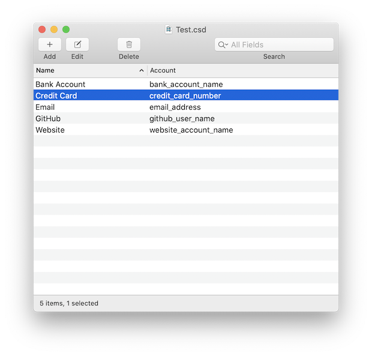

# CiphSwift

Modern native Mac application for storing encrypted account/password pairs and associated metadata.
Fully compatible with (and inspired by) the venerable [CiphSafe](http://ciphsafe.sourceforge.net).

Users can create encrypted documents consisting of entries (internet accounts, bank accounts, credit cards, etc.), with fields such as passwords, URLs, categories, and rich text notes.

### Security and Privacy

CiphSwift files (like CiphSafe files) are encrypted with 320-bit Blowfish encryption.
CiphSwift uses Apple's Common Crypto library for handling the cryptography. Anyone who is interested in encouraged to audit the source code to see if it is suited for their needs.

CiphSwift does not collect, store, analyze, or transmit any user data whatsoever.

### Contributions

Contributions (bug reports, pull requests, translations, etc.) are more than welcome.

### Credits

The application icon is from Icon Leak (@IconLeak on Twitter).

### Misc.

The passphrase for the test document is `test`. (Please use a stronger passphrase in practice!)